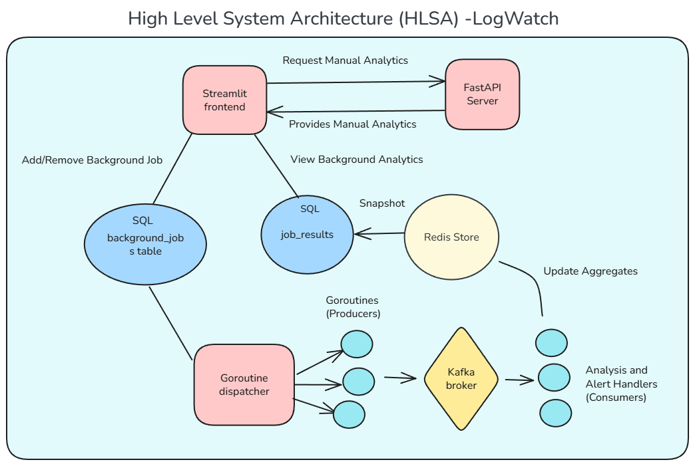

# **LogWatch**

_A Modular Framework for Intelligent Log Analysis and Real-Time Alerting_



# 🔍 LogWatch – A Distributed Log Analysis & Alerting Framework

**LogWatch** is a modular, scalable framework for real-time and background log analysis across distributed microservices. Built with modern cloud-native tools like **FastAPI**, **Kafka**, **Streamlit**, **Redis**, and **MySQL**, it allows you to:

- Analyze logs manually or on a schedule  
- Monitor multiple microservices (e.g., Auth, DNS, Firewall)  
- Trigger alerts via Email or Slack  
- Visualize results through an interactive dashboard  

---

## 🚀 Features

- ✅ User login and service selection  
- ✅ Manual log analysis via FastAPI  
- ✅ Background job scheduling with Kafka  
- ✅ Redis-based snapshot storage for fast reads  
- ✅ Periodic persistence to MySQL  
- ✅ Alerts via Email or Slack when thresholds are crossed  
- ✅ Simulated microservices for testing: Auth, DNS, Firewall  

---

## ⚙️ Technology Stack

| Component       | Technology     |
|----------------|----------------|
| Frontend UI     | Streamlit      |
| Backend API     | FastAPI        |
| Messaging       | Kafka          |
| Caching Layer   | Redis          |
| Persistent DB   | MySQL          |
| Log Collector   | Graylog (GELF) |
| DevOps          | Docker Compose |
| Alert Channels  | Email, Slack   |

---

## 🧪 Microservice Log Simulators

Simulated services that push structured logs to Graylog:

- `auth_service_log.py` – simulates login attempts and failures  
- `dns_service_log.py` – simulates DNS resolution failures  
- `firewall_service_log.py` – simulates firewall alerts with threat levels  

---

## 🛠️ Setup Instructions

### 🔁 Prerequisites

- Docker & Docker Compose  
- Python 3.8+  
- Graylog running on `localhost:12201` (or modify configs)

### 🔧 One-Click Setup

```bash
chmod +x startup.sh
./startup.sh
```

This will:
- Install dependencies  
- Start Kafka, Redis, and MySQL via Docker  
- Launch FastAPI and Streamlit  
- Start Kafka consumers and snapshot services  

---

## 🧪 Usage

### ➤ Manual Analysis

- Access the frontend at `http://localhost:8501`  
- Log in or register  
- Add services and select analysis types  
- View visual output for errors, patterns, and alerts  

### ➤ Background Jobs

- Schedule analytics to run every N seconds  
- Configure alert thresholds  
- View results updated in real-time  

---

## 📊 Sample Visualizations

- Time series of log patterns  
- Tables showing users with failed logins  
- Geo maps of failed login IPs  
- DNS failure domains and reasons  

---

## 🔐 Security

- Passwords are hashed with bcrypt  
- Job access is user-specific  
- Alerts are explicitly configured per job  
- Environment variables are managed securely  

---

## 📁 Project Structure

```
├── fastapiserver.py           # Backend API logic
├── frontend.py                # Streamlit-based UI
├── functions.py               # Analysis functions
├── background_functions.py    # Redis updates, alerting
├── background_task_handler/
│   ├── failed_login_consumer.py
│   ├── dns_consumer.py
│   ├── high_threat_protocol_consumer.py
│   └── ...
├── config/
│   └── .env                   # Environment configuration
├── database/
│   └── logwatchdatabase.sql   # MySQL schema
├── startup.sh                 # One-command bootstrap
├── docker-compose.yml         # Docker container orchestration
└── log generators/
    ├── auth_service_log.py
    ├── dns_service_log.py
    └── firewall_service_log.py
```

---

## 🧩 Future Improvements

- Add support for real-world log formats (e.g., syslog, app logs)  
- Integrate anomaly detection using ML  
- Introduce role-based access control (RBAC)  
- Scale it to multiple log managers/backend plugins

---

## 🤝 Contributing

Contributions are welcome!  
Feel free to open issues or submit pull requests for enhancements.

---

## 📜 License

This project is licensed under the MIT License.

---

## 🙌 Acknowledgements

- FastAPI, Streamlit, Redis, Apache Kafka  
- Graylog for log collection  
- Python community for libraries and tools  
